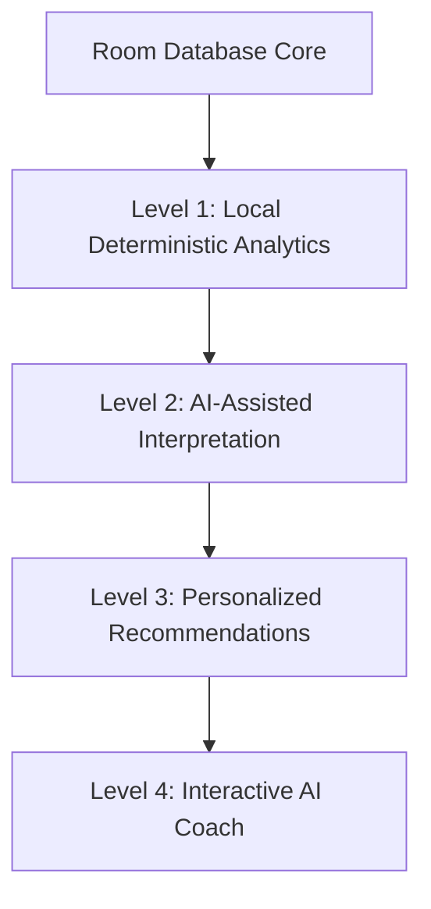
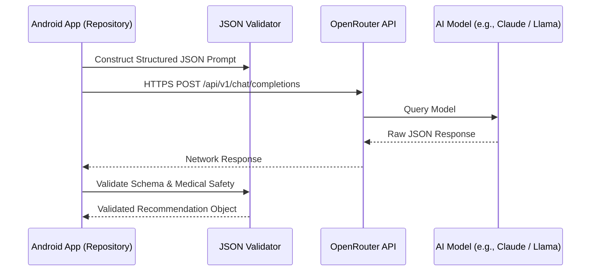

# OpenRouter AI & Data Analytics Architecture Roadmap

## 1. Overview & Core Principles

Kinetiq's AI integration is designed around a **Local-First, Deterministic Data Core**.
The local Room database is the **sole source of truth** for all user metrics, workout logs, weight history, and nutrition logs.

> [!IMPORTANT]
> The AI layer NEVER blindly alters user database records. All AI suggestions must be validated, presented as recommendation cards, and explicitly confirmed by the user before taking effect.

---

## 2. Progressive 4-Level Analytics Architecture

### Level 1 — Local Deterministic Analytics (No AI / Offline)
- Pure Kotlin calculations derived from Room data.
- Metrics: Weekly workout completion %, volume progression (kg x reps), streak counter, weight trajectory trend line, calorie/macro adherence ratios.

### Level 2 — AI-Assisted Progress Interpretation
- Summarized Level 1 metrics sent to OpenRouter as structured JSON.
- Generates natural-language weekly summaries, observations, and progress insights.

### Level 3 — Personalized Recommendations
- AI suggests next week's training adjustments (e.g. +1 set on Chest, progressive overload suggestions, macro tweaks).
- User must approve any proposed change.

### Level 4 — Interactive AI Coach (Natural Language Q&A)
- User asks questions: *"Why am I not progressing on my bench press?"* or *"Suggest a meal for dinner with 40g protein."*
- AI answers using the user's actual Room database context without hallucination.

---

## 3. OpenRouter System Architecture

### Security & Production Considerations
- **API Key Security**: For production releases, calls should be routed through a lightweight proxy server (Firebase Cloud Functions or Cloud Run) to avoid embedding production keys in APKs.
- **Cost & Token Control**:
  - Caching identical requests (e.g. daily summary calculated once per 24h).
  - Model selection strategy: Fast, lightweight models for simple summaries; reasoning models for complex program adjustments.
- **Local Fallback**: If offline or rate-limited, the app gracefully falls back to Level 1 deterministic local analytics without error dialogs.

---

## 4. Future Implementation Phases

| Phase | Title | Focus | Status |
| :--- | :--- | :--- | :--- |
| **Phase 10** | OpenRouter AI Infrastructure | Proxy/Repository, API Vault, Rate Limiting, JSON Validator | PLANNED |
| **Phase 11** | Level 2 & 3 AI Analytics & Suggestions | Structured JSON prompts for weekly progress & volume adjustments | PLANNED |
| **Phase 12** | Level 4 Interactive AI Coach | Conversational coaching with safety filters & injury protection | PLANNED |
